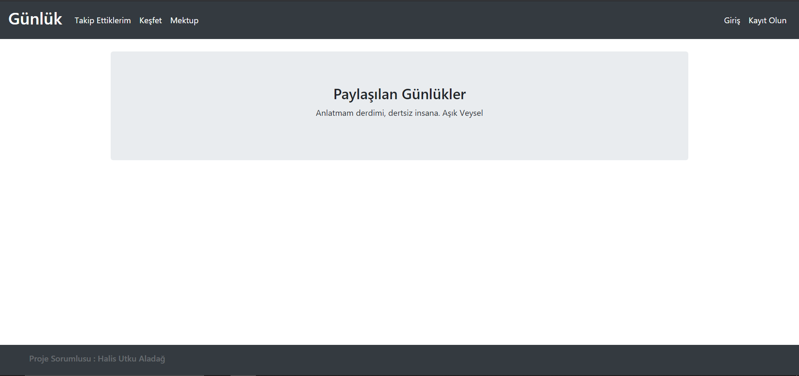

# Günlük Form Sitesi Projesi
&nbsp;&nbsp;&nbsp;&nbsp;İnsanların anonim olarak günlüklerini yazabilecekleri, kaydedebileceği, paylaşabileceği bir form sitesi.



</br>
</br>

# Özellikleri
- Kolay kayıt ekranı
- Paylaşım arama kutusu
- Kullanıcı Panelli
- Paylaşılan gönderilerin düzenleme ve silme
- sha256 Kriptolu şifreleme
- Paylaşım beğeni ( Gelecek güncelleme )
- Kullanıcı takibi ( Gelecek güncelleme )
- Kullanıcı mesaj gönderme ( Gelecek güncelleme )

# Kurulum
### MySql için 

Gunluk adında bir database yaratılır ve ardından aşağıdaki tablolar yaratılır.
```SQL

    CREATE TABLE IF NOT EXISTS users (id integer PRIMARY KEY AUTO_INCREMENT,name TEXT,email TEXT,username TEXT,password TEXT)

    CREATE TABLE IF NOT EXISTS article (id integer PRIMARY KEY AUTO_INCREMENT,title TEXT,author TEXT,content TEXT,username TEXT)

```
- pip install flask

- pip install flask_mysqldb

- pip install wtforms

- pip install passlib

- pip install email_validator
